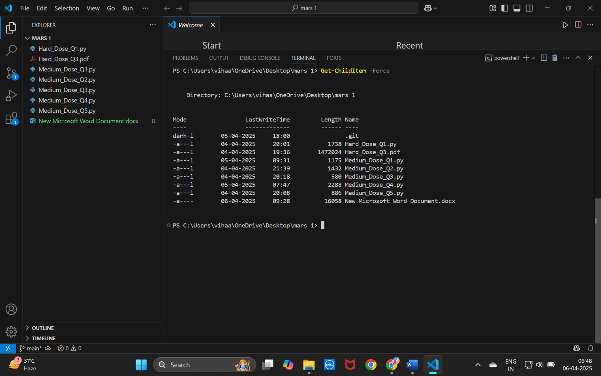
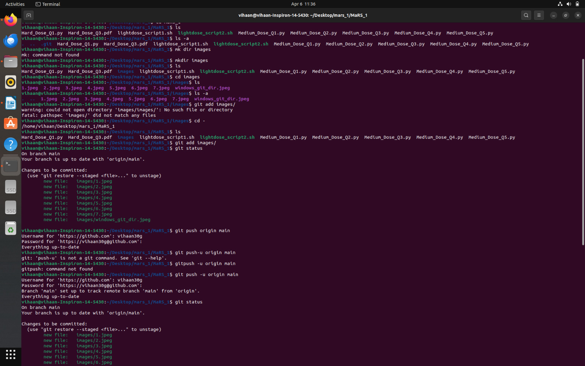
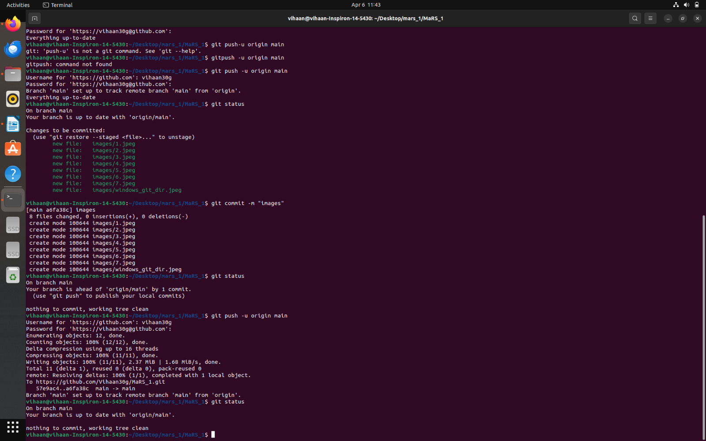
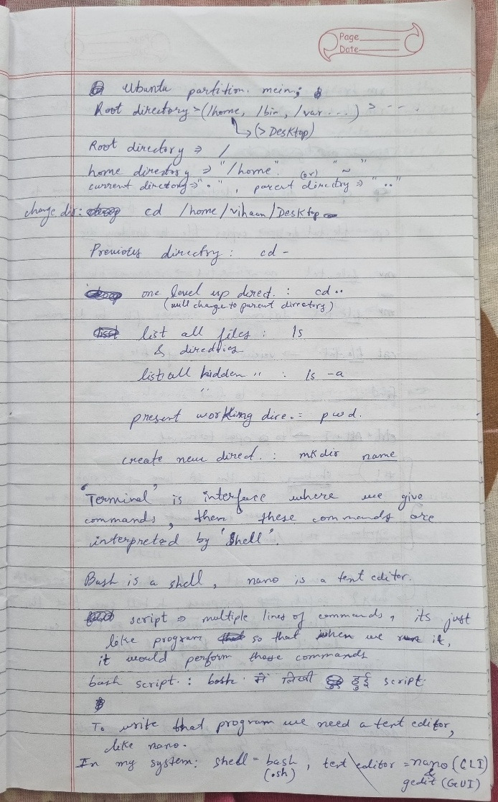
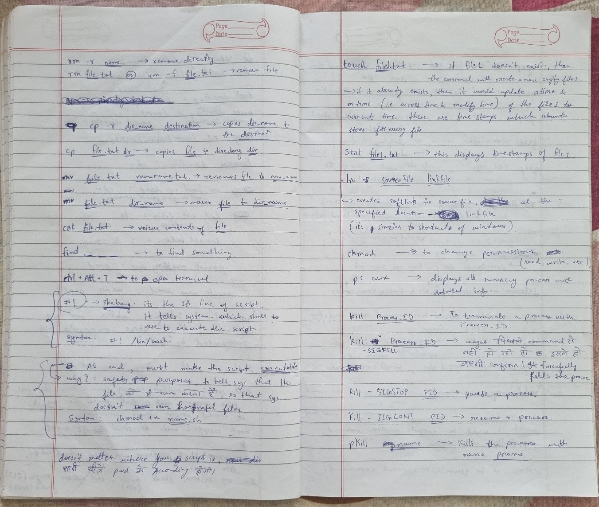
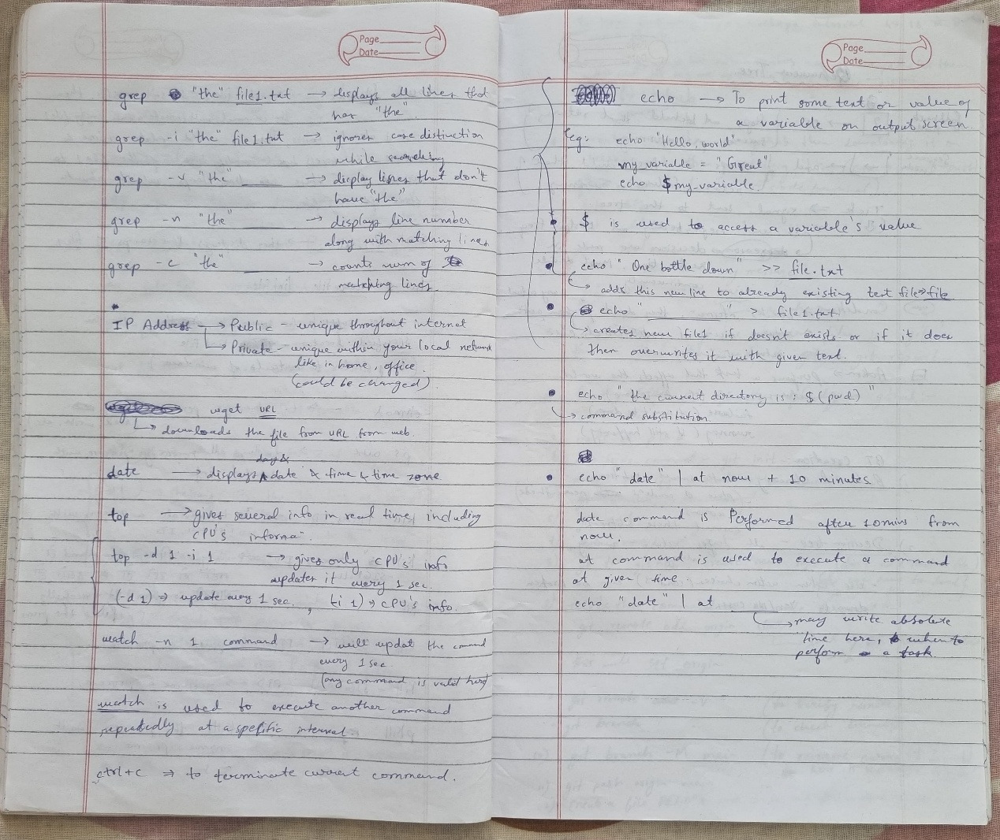
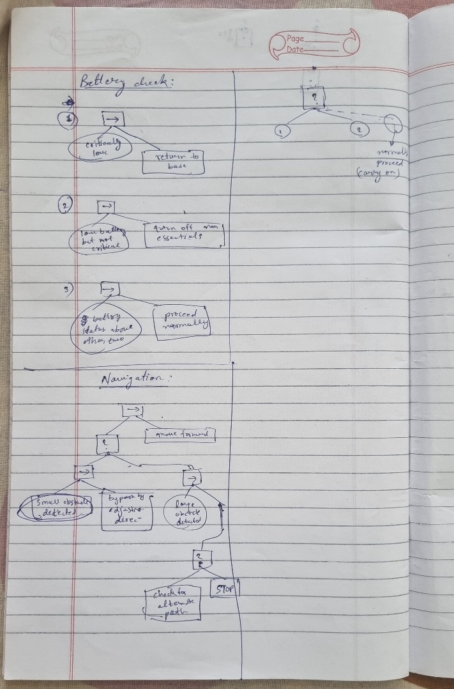
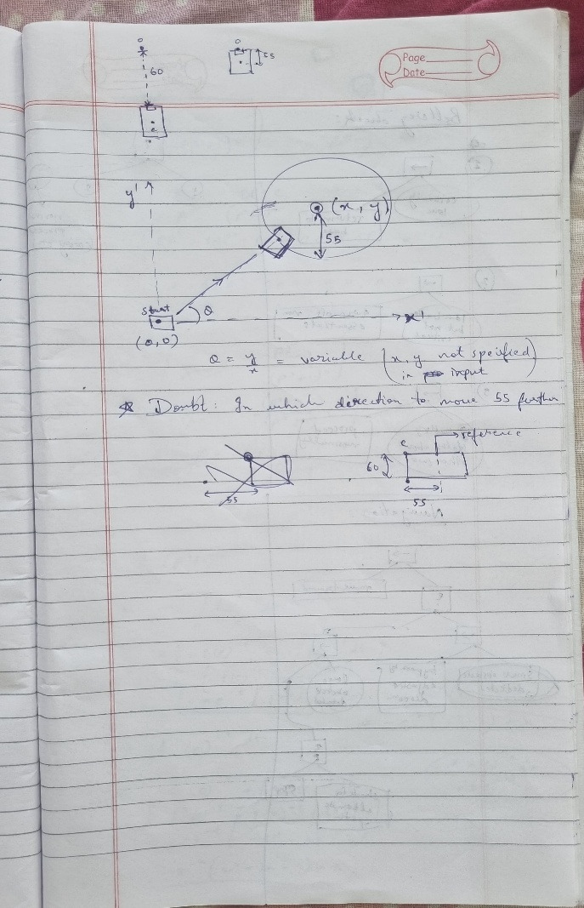
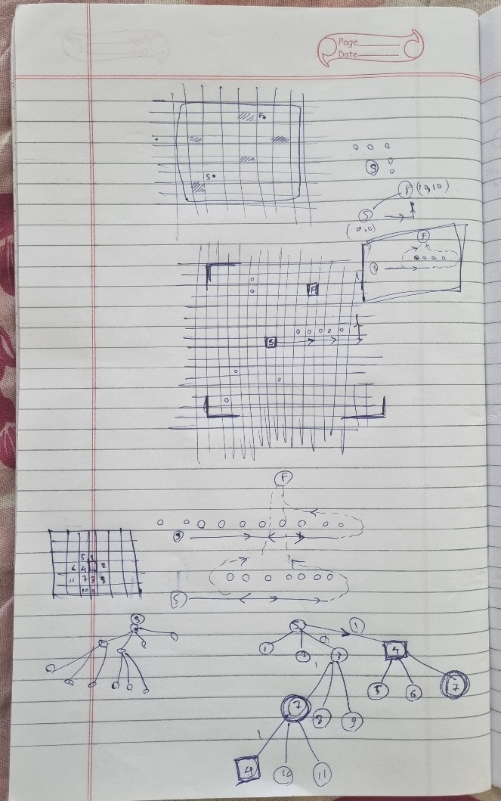

### **NOTE**  
The solutions of all the attempted questions are uploaded in this repository as separate files.  
Hard dose Q3 is in .pdf format.  
command screenshots and other images as asked are in "images" directory.  
These are the problems solved by me : Light dose- 1,2 ; Medium Dose- 1,2,3,4,5 ; Hard dose- 1(1st part), 3  

## **Overall Experience**  
You are not bound, you learn as deep as you like, you explore as much as you can. That’s what I loved the most in this task.
The learning process was great. In addition to technical stuff, I got to learn such important things, like using GitHub, getting comfortable with Ubuntu, etc.
Solving medium and hard dose problems was real fun. Also, I recently got familiar with Python, this task gave me a good opportunity to test myself with Python and applying NumPy practically.  

## **Challenges Faced**  
I mainly faced difficulty while solving 1st & 4th medium questions and “shortest path” in hard dose.  

In **medium Q1**, I was taking (x, y, z) to be the regular coordinate system with the rover moving in the x-y plane and z as height. This made it almost impossible to give a specific answer.
While exploring **hard dose Q2**, I read somewhere that z was the axis in which the rover moved forward and backward, it was relative to the camera. This gave me the hint to solve **medium Q1**.  

In **medium Q4**, I did not know how to compare which combination of filters gives the best result. After some research, I learned about data filtering (noise and smoothness of data).
But still, I couldn’t automate the comparison between various outputs and conclude which is the best.  

**Shortest path problem** is really a good way to learn several topics. I gave it several attempts, but whatever I thought always had some cases in which the idea wouldn’t work.
Finally, I referred to online materials (YouTube & AI tools), to realize that to create a perfect solution, I will have to understand – *“how they use graphs to represent the matrix and then how to apply BFS on it”*.
Dijkstra’s and A-star algorithms are not required in our situation.  

One more difficulty I had was while using Git on **Visual Studio**. *(I was using Visual Studio instead of VS Code till now.)*  

## **Learning Resources**  
- **Git & GitHub tutorial:** [Watch here](https://www.youtube.com/watch?v=Ez8F0nW6S-w&t=1454s)  
- **Behaviour Trees:** [Playlist](https://www.youtube.com/playlist?list=PLFQdM4LOGDr_vYJuo8YTRcmv3FrwczdKg)  
- **Linux commands:** *Linux Commands Cheat Sheet | GeeksforGeeks*  
- Other necessary theory was learned using AI tools. *(Very good way to learn, it's fast and clears almost all doubts.)*  

### **I forgot to take screenshots of terminal while pushing files to github, but following pics show my git repository and files on my system:**

### **Some of my rough works and learnings: **

